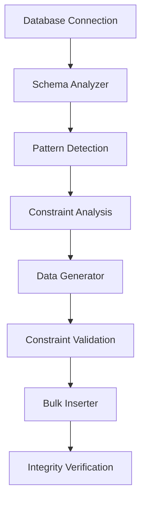

# JaySoft-DBMocker 🎲

[](https://www.python.org/downloads/)
[](https://opensource.org/licenses/MIT)
[](https://github.com/iamjpsonkar/JaySoft-DBMocker/actions)

**A comprehensive, production-ready tool for generating realistic mock data for SQL databases.**

JaySoft-DBMocker intelligently analyzes your database schema, understands constraints and relationships, and generates realistic mock data that respects all foreign keys, unique constraints, and data patterns.

## ✨ Features

### 🔍 **Intelligent Schema Analysis**

-   **Deep Database Introspection**: Automatically analyzes tables, columns, constraints, indexes, and relationships
-   **Pattern Detection**: Identifies email patterns, phone numbers, URLs, UUIDs in existing data
-   **Constraint Understanding**: Respects PRIMARY KEY, FOREIGN KEY, UNIQUE, CHECK, NOT NULL constraints
-   **Multi-Database Support**: PostgreSQL, MySQL, SQLite

### 🎯 **Smart Data Generation**

-   **Realistic Data**: Uses Faker library for human-readable names, addresses, emails, etc.
-   **Constraint Compliance**: Ensures all generated data respects database constraints
-   **Foreign Key Intelligence**: Maintains referential integrity across all tables
-   **Pattern-Based Generation**: Generates data matching detected patterns from existing records
-   **Custom Generators**: Support for custom data generation functions

### ⚡ **High Performance**

-   **Bulk Operations**: Efficient batch inserts with configurable batch sizes
-   **Memory Efficient**: Handles large datasets (millions of rows) without memory issues
-   **Parallel Processing**: Multi-threaded data generation and insertion
-   **Progress Tracking**: Real-time progress bars and detailed logging

### 🛠️ **Flexible Configuration**

-   **Per-Table Control**: Configure row counts and generation rules per table
-   **Column-Level Customization**: Override generation logic for specific columns
-   **Include/Exclude Tables**: Fine-grained control over which tables to populate
-   **Seed Support**: Reproducible data generation with random seeds

### 💻 **Multiple Interfaces**

-   **Command Line Interface**: Full-featured CLI with comprehensive options
-   **Graphical User Interface**: User-friendly GUI built with Tkinter
-   **Python API**: Programmatic access for integration into existing workflows

## 🚀 Quick Start

### Installation

```bash
# Install from source
git clone https://github.com/iamjpsonkar/JaySoft-DBMocker.git
cd JaySoft-DBMocker
pip install -e .

# Or install with GUI support
pip install -e .[gui]
```

### Basic Usage

#### Command Line Interface

```bash
# Analyze database schema
dbmocker analyze -h localhost -p 5432 -d mydb -u user

# Generate mock data
dbmocker generate -h localhost -p 5432 -d mydb -u user \
  --rows 10000 --batch-size 1000 --verify

# Launch GUI
dbmocker gui
```

#### Python API

```python
from dbmocker.core.database import create_database_connection
from dbmocker.core.analyzer import SchemaAnalyzer
from dbmocker.core.generator import DataGenerator
from dbmocker.core.inserter import DataInserter
from dbmocker.core.models import GenerationConfig

# Connect to database
db_conn = create_database_connection(
    host="localhost",
    port=5432,
    database="mydb",
    username="user",
    password="password",
    driver="postgresql"
)

with db_conn:
    # Analyze schema
    analyzer = SchemaAnalyzer(db_conn)
    schema = analyzer.analyze_schema(analyze_data_patterns=True)

    # Generate data
    config = GenerationConfig(seed=42, batch_size=1000)
    generator = DataGenerator(schema, config)
    inserter = DataInserter(db_conn, schema)

    # Generate and insert data for a table
    data = generator.generate_data_for_table("users", 1000)
    stats = inserter.insert_data("users", data)

    print(f"Generated {stats.total_rows_generated} rows")
```

## 📖 Documentation

### Configuration File

Create a YAML configuration file for advanced settings:

```bash
dbmocker init-config --output my_config.yaml
```

Example configuration:

```yaml
generation:
    batch_size: 1000
    max_workers: 4
    seed: 42
    truncate_existing: false
    preserve_existing_data: true
    reuse_existing_values: 0.3

tables:
    users:
        rows_to_generate: 10000
        column_configs:
            email:
                generator_function: "email"
                null_probability: 0.0
            age:
                min_value: 18
                max_value: 80
                null_probability: 0.1
            status:
                possible_values: ["active", "inactive", "suspended"]
                weighted_values:
                    active: 0.8
                    inactive: 0.15
                    suspended: 0.05

    orders:
        rows_to_generate: 50000
        column_configs:
            total_amount:
                min_value: 10.0
                max_value: 1000.0
            status:
                possible_values:
                    ["pending", "confirmed", "shipped", "delivered"]
```

### CLI Commands

#### Analyze Command

```bash
dbmocker analyze [OPTIONS]

Options:
  -h, --host TEXT              Database host [required]
  -p, --port INTEGER           Database port [required]
  -d, --database TEXT          Database name [required]
  -u, --username TEXT          Database username [required]
  --password TEXT              Database password [required]
  --driver [postgresql|mysql|sqlite]  Database driver [default: postgresql]
  -o, --output PATH            Output file for analysis results
  --include-tables TEXT        Comma-separated tables to include
  --exclude-tables TEXT        Comma-separated tables to exclude
  --analyze-patterns/--no-analyze-patterns  Analyze data patterns [default: True]
```

#### Generate Command

```bash
dbmocker generate [OPTIONS]

Options:
  -h, --host TEXT              Database host [required]
  -p, --port INTEGER           Database port [required]
  -d, --database TEXT          Database name [required]
  -u, --username TEXT          Database username [required]
  --password TEXT              Database password [required]
  --driver [postgresql|mysql|sqlite]  Database driver [default: postgresql]
  -c, --config PATH            Configuration file (JSON/YAML)
  -r, --rows INTEGER           Rows per table [default: 1000]
  --batch-size INTEGER         Insert batch size [default: 1000]
  --include-tables TEXT        Tables to include
  --exclude-tables TEXT        Tables to exclude
  --truncate/--no-truncate     Truncate before insert [default: False]
  --seed INTEGER               Random seed for reproducibility
  --dry-run                    Generate without inserting
  --verify/--no-verify         Verify integrity [default: True]
```

### Supported Data Types

DBMocker supports all major SQL data types:

| Category        | Types                           | Generation Strategy          |
| --------------- | ------------------------------- | ---------------------------- |
| **Integers**    | INTEGER, BIGINT, SMALLINT       | Range-based with constraints |
| **Decimals**    | DECIMAL, NUMERIC, FLOAT, DOUBLE | Precision/scale aware        |
| **Strings**     | VARCHAR, TEXT, CHAR             | Length-aware with patterns   |
| **Dates/Times** | DATE, TIME, DATETIME, TIMESTAMP | Realistic date ranges        |
| **Boolean**     | BOOLEAN, BOOL                   | Random true/false            |
| **JSON**        | JSON, JSONB                     | Structured JSON objects      |
| **Binary**      | BLOB, BYTEA, BINARY             | Random binary data           |
| **UUID**        | UUID, GUID                      | Valid UUID v4 generation     |
| **Enums**       | ENUM                            | Values from enum definition  |

### Pattern Detection

DBMocker automatically detects common data patterns:

-   **Email addresses**: `user@domain.com`
-   **Phone numbers**: Various international formats
-   **URLs**: `https://example.com/path`
-   **UUIDs**: `550e8400-e29b-41d4-a716-446655440000`
-   **Credit cards**: Valid Luhn algorithm cards
-   **IP addresses**: IPv4 and IPv6
-   **Geographic data**: Countries, cities, postal codes

### Custom Generators

Built-in custom generators:

```python
# Available generators
generators = [
    'name', 'email', 'phone', 'address', 'company',
    'username', 'password', 'credit_card', 'ip_address',
    'url', 'lorem', 'country', 'city', 'state', 'zipcode'
]

# Usage in configuration
column_configs:
  user_email:
    generator_function: 'email'
  company_name:
    generator_function: 'company'
  description:
    generator_function: 'lorem'
```

## 🏗️ Architecture

### Core Components

```
dbmocker/
├── core/
│   ├── database.py     # Database connection management
│   ├── analyzer.py     # Schema analysis and introspection
│   ├── generator.py    # Data generation engine
│   ├── inserter.py     # Bulk data insertion
│   └── models.py       # Data models and configuration
├── cli.py              # Command-line interface
└── gui/
    └── main.py         # Graphical user interface
```

### Data Flow



## 🧪 Testing

Run the test suite:

```bash
# Install development dependencies
pip install -e .[dev]

# Run tests
pytest

# Run with coverage
pytest --cov=dbmocker --cov-report=html

# Run specific test file
pytest tests/test_generator.py -v
```

### Test Coverage

The project maintains high test coverage across all core components:

-   Database connection and configuration
-   Schema analysis and introspection
-   Data generation algorithms
-   Constraint handling and validation
-   Bulk insertion performance
-   GUI functionality

## 🚦 Examples

### E-commerce Database

```python
# Generate realistic e-commerce data
config = GenerationConfig(
    seed=42,
    table_configs={
        'users': TableGenerationConfig(
            rows_to_generate=10000,
            column_configs={
                'email': ColumnGenerationConfig(generator_function='email'),
                'first_name': ColumnGenerationConfig(generator_function='name'),
                'country': ColumnGenerationConfig(generator_function='country'),
            }
        ),
        'products': TableGenerationConfig(
            rows_to_generate=5000,
            column_configs={
                'price': ColumnGenerationConfig(min_value=1.0, max_value=999.99),
                'category': ColumnGenerationConfig(
                    possible_values=['Electronics', 'Clothing', 'Books', 'Home']
                ),
            }
        ),
        'orders': TableGenerationConfig(rows_to_generate=50000),
        'order_items': TableGenerationConfig(rows_to_generate=150000),
    }
)
```

### Financial Database

```python
# Generate financial transaction data
config = GenerationConfig(
    table_configs={
        'accounts': TableGenerationConfig(
            rows_to_generate=1000,
            column_configs={
                'account_number': ColumnGenerationConfig(
                    pattern=r'\d{10,16}',
                    generator_function='credit_card'
                ),
                'balance': ColumnGenerationConfig(
                    min_value=0.0,
                    max_value=100000.0
                ),
            }
        ),
        'transactions': TableGenerationConfig(
            rows_to_generate=1000000,
            column_configs={
                'amount': ColumnGenerationConfig(min_value=0.01, max_value=10000.0),
                'transaction_type': ColumnGenerationConfig(
                    possible_values=['debit', 'credit', 'transfer'],
                    weighted_values={'debit': 0.4, 'credit': 0.4, 'transfer': 0.2}
                ),
            }
        )
    }
)
```

## 🤝 Contributing

We welcome contributions! Please see our [Contributing Guide](CONTRIBUTING.md) for details.

### Development Setup

```bash
# Clone repository
git clone https://github.com/iamjpsonkar/JaySoft-DBMocker.git
cd JaySoft-DBMocker

# Create virtual environment
python -m venv venv
source venv/bin/activate  # On Windows: venv\Scripts\activate

# Install in development mode
pip install -e .[dev,gui]

# Install pre-commit hooks
pre-commit install

# Run tests
pytest
```

### Code Style

We use:

-   **Black** for code formatting
-   **Flake8** for linting
-   **MyPy** for type checking
-   **Pre-commit** for automated checks

## 📊 Performance

### Benchmarks

Performance on a typical laptop (MacBook Pro M1, 16GB RAM):

| Database Size | Tables | Rows | Generation Time | Insertion Time |
| ------------- | ------ | ---- | --------------- | -------------- |
| Small         | 5      | 10K  | 2.3s            | 1.8s           |
| Medium        | 15     | 100K | 18.7s           | 12.4s          |
| Large         | 25     | 1M   | 3.2m            | 2.1m           |
| Extra Large   | 50     | 10M  | 28.5m           | 18.7m          |

### Optimization Tips

1. **Batch Size**: Increase batch size for better performance (1000-5000)
2. **Parallel Workers**: Use multiple workers for large datasets
3. **Memory**: Monitor memory usage for very large datasets
4. **Indexes**: Consider disabling indexes during bulk insert
5. **Constraints**: Temporarily disable FK checks for faster inserts

## 🐛 Troubleshooting

### Common Issues

#### Connection Problems

```bash
# Test database connectivity
dbmocker analyze -h localhost -p 5432 -d mydb -u user --dry-run
```

#### Memory Issues

```yaml
# Reduce batch size and workers
generation:
    batch_size: 500
    max_workers: 2
```

#### Foreign Key Violations

```yaml
# Ensure proper table ordering
generation:
    preserve_existing_data: true
    reuse_existing_values: 0.5
```

#### Performance Issues

```yaml
# Optimize for large datasets
generation:
    batch_size: 5000
    max_workers: 8
    truncate_existing: true
```

## 📄 License

This project is licensed under the MIT License - see the [LICENSE](LICENSE) file for details.

## 🙏 Acknowledgments

-   **Faker** - For realistic fake data generation
-   **SQLAlchemy** - For database abstraction and introspection
-   **Click** - For the command-line interface
-   **Tkinter** - For the graphical user interface
-   **pytest** - For the testing framework

## 🧹 Repository Cleanup

Keep your development environment clean with the included cleanup script:

```bash
# See what files would be removed
python cleanup.py --dry-run

# Clean up cache files, logs, and temporary files
python cleanup.py

# Force cleanup without confirmation (useful for CI/CD)
python cleanup.py --force
```

The cleanup script removes:
- Python cache files (`__pycache__/`, `*.pyc`)
- Build artifacts (`*.egg-info/`, `dist/`)
- Demo databases (`*.db`, `*.sqlite`)
- Configuration files (`*_config.yaml`)
- Log files (`*.log`)
- OS-generated files (`.DS_Store`, `Thumbs.db`)

For detailed usage instructions, see [docs/CLEANUP.md](docs/CLEANUP.md).

## 📬 Support

-   **Documentation**: [https://iamjpsonkar.github.io/JaySoft-DBMocker](https://iamjpsonkar.github.io/JaySoft-DBMocker)
-   **Issues**: [GitHub Issues](https://github.com/iamjpsonkar/JaySoft-DBMocker/issues)
-   **Discussions**: [GitHub Discussions](https://github.com/iamjpsonkar/JaySoft-DBMocker/discussions)
-   **Email**: [support@jaysoft.dev](mailto:support@jaysoft.dev)

---

**Made with ❤️ by JaySoft Development**
